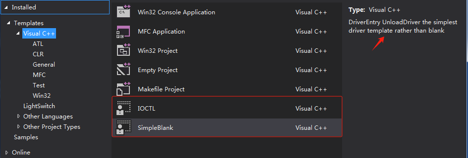
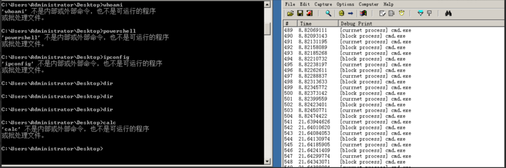
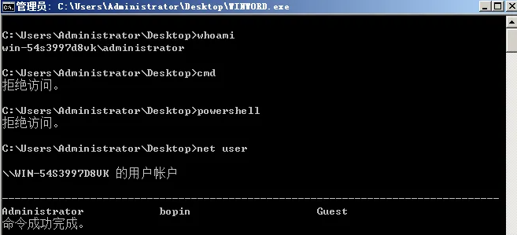

# VS12_DriverTemplates

## How to use

> 使用其他人的模板，将zip文件安装到
>
> C:\Users<username>\Documents\Visual Studio 2012\My Exported Templates\
>
> 模板路径不清楚的 参考 
>
> https://learn.microsoft.com/zh-cn/visualstudio/ide/how-to-create-item-templates?view=vs-2022

> 每种模板都包含简单的描述信息

> ps:  每种模板都简单做过测试 不会触发BSOD    (测试平台 :  windows server 2008 r2 x64)

## SimpleBlank

> 跟空项目差不多 

## IOCTL

> 创建驱动对象，符号链接，用来和用户态通信。

## Minifilter

> minifilter   对文件IRP 创建，读取，写入，设置信息进行监控和拦截。

## Minifilter2

> 使用文件后缀,  当前IRP发起方进程名称进行拦截  默认是cmd, powershell进程

## ProcessThreadImageCallback

> 进程，线程，Image通知回调
>
> 默认进程创建阻止规则是  Office进程创建cmd, powershell进程

- [ ] 驱动联动监控Web和系统服务创建敏感进程
- [ ] 创建线程联动用户态程序扫描进程创建线程的内存   reference  wdfilter.sys
- [ ] Image加载  Dll Hijacking Detect

